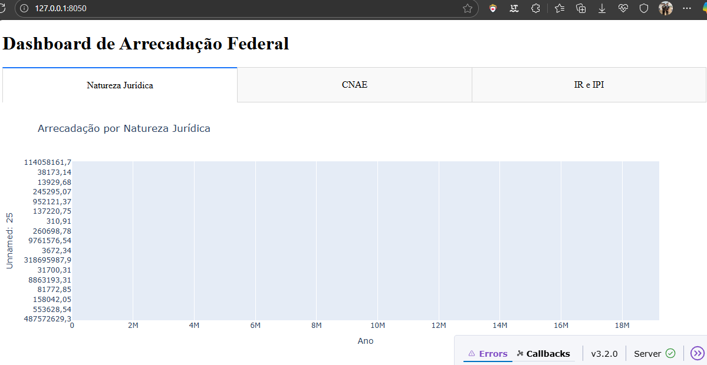

# Portfólio-como-Analista-de-Dados
Entendendo as características dos resultado da arrecadação de impostos e contribuições federais administrados pela Secretaria Especial da Receita Federal do Brasil (RFB).

**Observação:** Essa é uma análise Descritiva, Preditiva e Prescritiva das informações de arrecadação, com foco no aprendizado com Analista de Dados. Dessa forma, o estudo contou com a análise contou com a extração dos dados a partir arquivos locais em formato "csv", depois está sendo realizado a limpeza dos dados. 

- Dados extraídos, limpos e analisados com foco em gerar insights sobre o mercado de compras públicas.


Último acesso: 27/08/2025
Onde está vindo os dados https://dados.gov.br/dados/conjuntos-dados/resultado-da-arrecadacao

## **Notebooks**

**1 - Arrecadação por Natureza Jurídica e Tributo**

Dicionário de Dados Arrecadação por Natureza Jurídica e Tributo - PDF

O arquivo relaciona as informações que possibilitam organizar, classificar, relacionar e inferir novos dados sobre o conjunto de dados da Arrecadação por Natureza Jurídica e Tributo.

Acessado em 27/08/2025: https://www.gov.br/receitafederal/dados/arrecadacao-natureza-metadados.pdf

Arrecadação por Natureza Jurídica e Tributo

Contém os dados de arrecadação bruta mensal realizadas em Documento de Arrecadação de Receitas Federais (Darf), por tributo, efetuada pelos diversos tipos de Naturezas Jurídicas.

**2 - Arrecadação por CNAE e Tributo**

Dicionário de Dados Arrecadação por CNAE e Tributo - PDF

O arquivo relaciona as informações que possibilitam organizar, classificar, relacionar e inferir novos dados sobre o conjunto de dados da Arrecadação por CNAE e Tributo.

Acessado em 27/08/2025: https://www.gov.br/receitafederal/dados/arrecadacao-cnae-metadados.pdf

Arrecadação por CNAE e Tributo

Contém os dados de arrecadação bruta mensal realizadas em Documento de Arrecadação de Receitas Federais (Darf), por tributo, efetuada pelos setores econômicos, identificados pela seção, constantes da tabela de Classificação Nacional de Atividades Econômicas (Cnae).

**3 - Arrecadação de IR e IPI detalhada**

Dicionário de Dados Arrecadação de IR e IPI detalhada

O arquivo relaciona as informações que possibilitam organizar, classificar, relacionar e inferir novos dados sobre o conjunto de dados da Arrecadação de IR e IPI detalhada.

Acessado em 27/08/2025: https://www.gov.br/receitafederal/dados/arrecadacao-ir-ipi-metadados.pdf

Arrecadação de IR e IPI detalhada

Contém os dados de arrecadação decendial do Imposto sobre a Renda (IR) e do Imposto sobre Produtos Industrializados (IPI), discriminados por arrecadação bruta, os respectivos eventos que afetam essa arrecadação bruta e a arrecadação líquida, valor este último passível de repasse aos Fundos de Participação dos Estados e do Municípios, FPM e FPE, de acordo com dispositivo constitucional.
______

# Estrutura do Dashboard Interativo

## Como rodar o projeto (Dashboard)

1. **Pré-requisitos:**
	- Python 3.8 ou superior instalado ([download aqui](https://www.python.org/downloads/)).
	- Recomenda-se utilizar ambiente virtual (venv).

2. **Instale as dependências:**
	- No terminal, execute:
	  ```bash
	  pip install -r requirements.txt
	  ```

3. **Execute o dashboard:**
	- No terminal, execute:
	  ```bash
	  python app/dashboard.py
	  ```
	- O Dash irá rodar localmente. Acesse o endereço exibido no terminal (ex: http://127.0.0.1:8050) para visualizar o dashboard.

4. **Estrutura dos dados:**
	- Os arquivos CSV devem estar na pasta `data/` na raiz do projeto:
	  - `arrecadacao-natureza.csv`
	  - `arrecadacao-cnae.csv`
	  - `arrecadacao-ir-ipi.csv`

## Visualizações disponíveis no dashboard

- **Aba Natureza Jurídica:** Gráfico de barras com a arrecadação por natureza jurídica.
- **Aba CNAE:** Gráfico de barras com a arrecadação por setor econômico (CNAE).
- **Aba IR e IPI:** Gráfico de linha com a arrecadação detalhada de IR e IPI ao longo do tempo.

## Funcionalidades

- Visualização interativa dos dados de arrecadação federal.
- Navegação por abas para diferentes perspectivas dos dados.
- Código modular e pronto para expansão (ex: filtros, novos gráficos, exportação de dados etc).

**Print da tela**



---

## Por que Dash?

A biblioteca **Dash** foi escolhida para a construção do dashboard por ser uma das soluções mais robustas e flexíveis para visualização de dados interativos em Python. O Dash permite criar aplicações web com gráficos dinâmicos e interativos utilizando apenas Python, sem necessidade de conhecimento avançado em front-end. Além disso, integra-se facilmente com bibliotecas como Plotly e Pandas, facilitando a manipulação e exibição dos dados analisados nos notebooks.

Principais motivos para a escolha:
- Permite criar dashboards web responsivos e interativos rapidamente.
- Suporte nativo a gráficos avançados (Plotly) e manipulação de dados (Pandas).
- Código 100% Python, facilitando a manutenção e expansão por analistas de dados.
- Comunidade ativa e documentação abrangente.

## Estrutura de Pastas do Projeto

O projeto foi organizado para separar claramente dados, notebooks, scripts de aplicação e utilidades, facilitando a manutenção e a colaboração:

```
Analise_Dados/
│
├── app/                # Scripts de aplicação e dashboards (ex: dashboard.py)
│
├── data/               # Dados brutos e processados (arquivos .csv)
│
├── notebooks/          # Notebooks de análise exploratória e modelagem
│
├── src/                # Utilitários, funções auxiliares e imagens
│   ├── images/         # Prints e imagens usadas na documentação
│   └── utils.py        # Funções de apoio
│
├── requirements.txt    # Dependências do projeto
├── README.md           # Documentação principal
```

Essa estrutura permite que cada etapa do fluxo de análise (extração, análise, visualização e documentação) fique bem organizada e independente, facilitando tanto o desenvolvimento quanto a reprodução dos resultados.